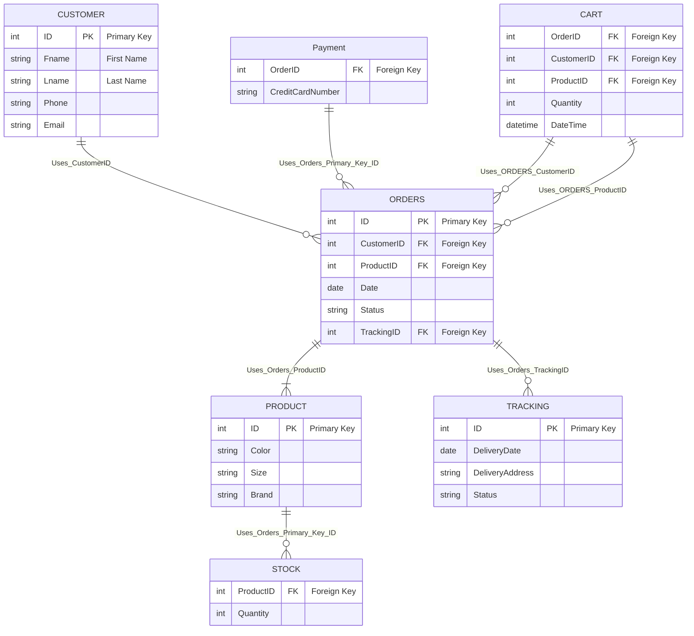

# SE211 | Group6 | MySQL GitHub README
---
### Database Grading Criteria:  

#### Report writing: 10 points  
- We used this [GitHub Repo README](https://github.com/Calvin-Schmeichel/SE211-MySQL-Group6/blob/e6fc2bd99f136840379c2997ce2a38efd672574a/README.md) as our report writeup
#### Database design (schema, models, and normalization): 20 points
- [Database Schema](https://github.com/Calvin-Schmeichel/SE211-MySQL-Group6/tree/main#database-schema)
- [.sql Script with normalization and models](https://github.com/Calvin-Schmeichel/SE211-MySQL-Group6/blob/main/MySQL/MySQLScriptFINAL.sql)

#### Database implementation: 30 points
- [We used MySQL Workbench to implement our database](https://www.mysql.com/products/workbench/)
- [We also leveraged the Python MySQl Connector to interface with the database](https://www.mysql.com/products/connector/)

#### Database operations included (retrieval and update): 20 points
- [We used Python with some third party libraries to retrive and update data on the database](https://www.python.org/)

#### GUI design: 20 points 
- [GUI Code](https://github.com/Calvin-Schmeichel/SE211-MySQL-Group6/blob/0665e6ef0a55db13c4ef5082909b12dffbd65633/GUI/GUI_FINAL.py)
- [MySQL GUI Live Demo Running](https://www.youtube.com/watch?v=Fbay-wKbDds)

---
### Project Summary  

### Background and Motivation  

### System Functions  

### Schema design  
#### Database Schema


### Design models (one of the following: ER, EER, UML)
We chose to go with the _**Entity-Relationship (ER) model**_. We thought it made the most sense for our project since _ER_:
- Is primarily used for database design. It represents data in a database as entities and the relationships between these entities.
- In our schema, we have tables like Customers, Products, Orders, etc., which are typical entities. The relationships are indicated through foreign keys (EX: CustomerID in Orders references ID in Customers).
- The ER model is great for conceptualizing and designing a database at a high level, especially for relational databases like MySQL. [As represented in our Database Schema](https://github.com/Calvin-Schmeichel/SE211-MySQL-Group6/tree/main#database-schema)

### Normalization strategy
With out normalization strategy we wanted to make sure we:
- Reduce redundant data waste risk space
- Eliminate repeating groups in individual columns
- Use primary keys to show data is in relation with one another
- Create separate tables for each potential set of related data

**[Normalization strategy MOCK IMAGE HERE]**__

Those were our core values throuout the project. If we had more time we would have liked to focus on and add:

- Supporting Future Scalability
- Minimizing Null Values
- Balancing Normalization with Performance
- Indexing Strategy
- Documenting the Database Schema
- Audit and Security


### Operations can be Conducted on the Database System
Multiple operations can and are used on our Database System. We used [Python]((https://www.python.org/)) and a third party library called [mysql.connector](https://www.mysql.com/products/connector/) to interface with our database. Some of these operations are:
- `DROP DATABASE`
	- We used this operator to wipe our database clean for demo purposes.
```python
    mycursor.execute("DROP DATABASE IF EXISTS myStore;")
```
- `CREATE DATABASE`
  	- We used the operator to create our database.
```python
    mycursor.execute("CREATE DATABASE myStore;")
```
- `USE`
	- We used the operator to specify what database we are using for our demo.
```python
    mycursor.execute("USE myStore;")
```
- `CREATE TABLE`
	- We used the operator to generate our tables. (EX: Customers, Products, Tracking, Orders, Stock, Payment, Cart)
```python
    mycursor.execute("CREATE TABLE Customers(ID INT PRIMARY KEY AUTO_INCREMENT,Fname VARCHAR(40) NOT NULL,Lname VARCHAR(40),Phone VARCHAR(15) NOT NULL,Email VARCHAR(40));")
```
- `INSERT INTO`
	- We used the operator to insert our products into the database and the users input from the GUI to create and store their order and receipt.
```python
    mycursor.execute("INSERT INTO Products (Color, Size, Brand)VALUES ('Red', 'Large', 'Calvin Klein'),('Red', 'Medium', 'Calvin Klein'),('Red', 'Small', 'Calvin Klein'),('Blue', 'Large', 'Calvin Klein'),('Blue', 'Medium', 'Calvin Klein'),('Blue', 'Small', 'Calvin Klein'),('Green', 'Large', 'Calvin Klein'),('Green', 'Medium', 'Calvin Klein'),('Green', 'Small', 'Calvin Klein'),('Yellow', 'Large', 'Calvin Klein'),('Yellow', 'Medium', 'Calvin Klein'),('Yellow', 'Small', 'Calvin Klein');")
```
- `SELECT`
	- We used the operator to search and locate the correct ID keys when inserting into our tables.
```python
    mycursor.execute(f"SELECT ID FROM Products WHERE Color = '{color_var.get()}' AND Size = '{size_var.get()}';")
```

### Screen shots of your GUI  
---


### Code Documentation 

**Importing the required library:**  
- The `mysql.connector` library is imported to establish a connection to the MySQL database.
- Establishing a connection to the database: The mysql.connector.connect() method is used to establish a connection to the MySQL database. The host, port, username, password, and database name are provided as parameters.
- **Creating a cursor object:** A cursor object is created using the db.cursor() method to execute SQL queries.
- **Defining the printsql() function:** The printsql() function is defined to iterate through the query results and print them.
- **Dropping the existing database (if exists):** The mycursor.execute() method is used to execute the SQL query DROP DATABASE IF EXISTS myStore;. This query drops the existing database named "myStore" if it exists.
- **Creating a new database:** The mycursor.execute() method is used to execute the SQL query CREATE DATABASE myStore;. This query creates a new database named "myStore".
- **Using the newly created database:** The mycursor.execute() method is used to execute the SQL query USE myStore;. This query sets the newly created "myStore" database as the current database.
- **Creating tables for the store management system:**
  - _The mycursor.execute() method is used to execute a series of SQL queries to create the following tables:_
    - **Customers table:** Stores information about customers, including their ID, first name, last name, phone number, and email address.
    - **Products table:** Stores details about products, such as the ID, color, size, and brand.
    - **Tracking table:** Tracks the delivery status of orders, including the delivery date, delivery address, status, and a unique tracking ID.
    - **Orders table:** Manages the orders placed by customers, including the order ID, customer ID, product ID, order date, status, and tracking ID.
    - **Stock table:** Keeps track of the stock quantity for each product.
    - **Payment table:** Handles payment information for orders, storing the order ID and credit card number.
    - **Cart table:** Tracks the items added to the cart by customers, including the customer ID, product ID, and quantity.
    - **Inserting sample data into the Products table:** The mycursor.execute() method is used to execute an SQL query to insert sample data into the Products table. The INSERT INTO statement is used to specify the columns (Color, Size, Brand) and the values for each row.
    - **Inserting sample data into the Customers table:** The mycursor.execute() method is used to execute an SQL query to insert sample data into the Customers table. The INSERT INTO statement is used to specify the columns (Fname, Lname, Phone, Email) and the values for each row.
    - **Retrieving data from the Customers table:** The mycursor.execute() method is used to execute an SQL query to select all data from the Customers table. The query is then passed to the printsql() function to print the query results.
    - **Retrieving data from the Products table:** The mycursor.execute() method is used to execute an SQL query to select all data from the Products table. The query is then passed to the printsql() function to print the query results. 

### Python Script Overview  

The provided code sets up the necessary database structure for a store management system. It creates the required tables and inserts sample data for testing purposes. The code can serve as a foundation for building a complete store management application. 

Please note that additional code and user interface implementation may be required to utilize the database effectively in a real-world scenario. 

### Code Documentation 

This code is written in Python and utilizes the tkinter library to create a graphical user interface (GUI) for handling T-shirt purchases. The code allows users to enter their personal information, select the desired T-shirt color, size, and quantity, and then generate a mock receipt. 

### Functionality 

The code consists of the following key components: 

**handle_purchase() function:** This function is called when the user clicks the "Purchase" button. It retrieves the user's email, T-shirt color, size, and quantity from the respective input fields. It then generates a mock receipt string using f-strings and prints it to the console. Finally, it clears the email input field for the next entry. 

**Main window creation:** The main window is created using the tk.Tk() method. The title of the window is set to "T-Shirt Purchase" using the title() method. 

**User input fields:** The code creates several input fields for the user to enter their personal information, including email, first name, last name, and phone number. Each input field is created using the tk.Entry() method, and a label is associated with each input field using the tk.Label() method. 

**T-shirt color selection:** The user can choose the desired T-shirt color by selecting one of the available options (Red, Blue, Green, Yellow). Radio buttons are created for each color option using the tk.Radiobutton() method. The selected color is stored in the color_var variable, which is of type tk.StringVar(). 

**T-shirt size selection:** Similar to the color selection, the user can choose the T-shirt size by selecting one of the available options (Large, Medium, Small). Radio buttons are created for each size option using the tk.Radiobutton() method. The selected size is stored in the size_var variable, which is of type tk.StringVar(). 

**Quantity selection:** The user can choose the quantity of T-shirts they want to purchase by selecting one of the available options (1, 5, 10). Radio buttons are created for each quantity option using the tk.Radiobutton() method. The selected quantity is stored in the quantity_var variable, which is of type tk.StringVar(). 

**Purchase button:** The "Purchase" button is created using the tk.Button() method. When clicked, it calls the handle_purchase() function. 

**GUI event loop:** The code enters the GUI event loop using the mainloop() method of the main window. This ensures that the GUI remains responsive and can handle user interactions.

### Python Script Live Demo


[](https://www.youtube.com/watch?v=Fbay-wKbDds)

### Conclusion

The provided code demonstrates the use of tkinter library to create a GUI for handling T-shirt purchases. Users can enter their personal information, select the T-shirt color, size, and quantity, and generate a mock receipt. The code can serve as a basis for building a more comprehensive T-shirt purchasing system with additional features and database integration. 

Please note that further improvements, such as error handling and data validation, can be implemented to enhance the user experience and ensure data integrity.
